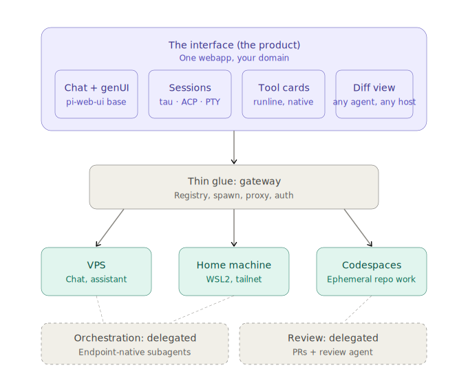

# Conduit

[](https://codespaces.new/jask-aran/Conduit?quickstart=1)



Conduit is an interface-first personal agent platform. The long-term thesis is
that an agent session is the common primitive while its interface, execution
target, harness, tools, and autonomy posture can vary.

The repository is currently at **Phase 0: build and evaluate the Pi web-chat
experience**. It contains a first-party Conduit chat and two upstream comparators,
all pointed at one project filesystem.

## Current state

| Folder | What it is | State | Use it for |
| --- | --- | --- | --- |
| [`phase-0-custom`](phase-0-custom) | First-party Conduit chat with a server-owned `pi --mode rpc` process | **Primary** | Build the Phase 0 chat and application seams |
| [`pi-tau-webserver`](pi-tau-webserver) | Tau UI with a server-owned Pi process per live tab | Comparator | Evaluate Tau's runtime boundary and behavior |
| [`phase-0-pi-web`](phase-0-pi-web) | PI WEB used as the complete application | Comparator | Evaluate its session daemon, workspaces and remote-machine model |

The custom surface is now the product direction. Pi Tau remains useful for
comparing its standalone server and RPC behavior; PI WEB remains useful for its
project/session hierarchy and remote-machine model.

All three use directories under `app/files`. The default `app/files/chat` is the
unstructured chat project. Every project stores Pi JSONL sessions in
`.conduit/sessions` and includes `.pi/settings.json`, allowing Pi instances
launched in that working directory to continue the same session files.

The original custom-app checkout lived in transient storage and was not
recoverable when this repository was prepared. `phase-0-custom` is a faithful
reconstruction of the implemented lifecycle, HTTP endpoints, session discovery,
and JSONL bridge—not a byte-for-byte archive.

## Recommended evaluation setup

In a Codespace, one command starts or restarts all three surfaces on separate
ports:

```bash
bash .devcontainer/start-evaluation.sh restart
```

- **Conduit · Custom** — port 4310, opened automatically;
- **Conduit · Pi Tau** — port 3001;
- **Conduit · PI WEB** — port 8504.

Do not have two surfaces write to the same JSONL simultaneously. Parallel chats
in the same project are safe.

Run Pi Tau inside WSL2 Ubuntu, where Pi is already installed and authenticated.
Open it from the Windows browser through WSL's localhost forwarding.

### Fastest path: private GitHub Codespace

Use the button above—or this permanent link—to open the evaluation environment:

<https://codespaces.new/jask-aran/Conduit?quickstart=1>

GitHub resumes a matching existing Codespace when one is available and creates
a fresh one from this repository's devcontainer when it is not. The link remains
usable after an old Codespace has been stopped or deleted; a newly created
Codespace will require Pi authentication again.

The included devcontainer automatically:

- creates a Node.js 22 Debian environment;
- installs native build tools;
- installs Pi `0.80.6` from its official npm package;
- installs Pi Tau pinned to upstream commit `af1f3dee`;
- starts Pi Tau and verifies its health on every Codespace start;
- forwards port `3001` as **Conduit · Pi Tau** and opens it automatically;
- installs the pinned PI WEB dependency;
- starts the PI WEB session daemon and web server;
- verifies PI WEB is healthy on every Codespace start and replaces stale
  processes automatically;
- forwards port `8504` as the optional **Conduit · PI WEB** comparator.

When setup finishes, use the Codespace terminal for the only credential-bearing
step:

```text
pi
/login
```

Choose the desired provider and complete its browser authentication. Exit Pi,
then restart Pi Tau before creating the first live tab so every spawned Pi
process sees the authenticated model registry. Authentication is not required
for the web UI itself to start:

```bash
bash .devcontainer/start-pi-tau.sh restart
```

Open the forwarded **Conduit · Pi Tau** port from the Codespace's Ports panel.
The forwarded port is private to your GitHub account by default; keep it private.

The Codespace is an evaluation host, not an always-on VPS. Its filesystem and Pi
authentication persist while the Codespace exists, but agents do not continue
running while GitHub has stopped the Codespace. Pi Tau and PI WEB restart
automatically when the Codespace starts again.

### Prerequisites

- WSL2 with Ubuntu;
- Node.js 22 or newer and npm;
- `git`;
- Pi Coding Agent installed as `pi`;
- Pi already authenticated with at least one usable model;
- build tools for native Node modules (`build-essential` and Python).

Check the environment:

```bash
node --version
npm --version
git --version
pi --version
pi
```

Start and exit an ordinary Pi session once before installing either web app. This proves
that authentication, model discovery, shell startup, and Pi's state directory all
work independently of Conduit.

On Ubuntu, install native build prerequisites if they are missing:

```bash
sudo apt update
sudo apt install -y build-essential python3
```

## Install the recommended Pi Tau version

```bash
git clone https://github.com/jask-aran/Conduit.git
cd Conduit/pi-tau-webserver
git clone https://github.com/milanglacier/pi-tau-web-server.git \
  ~/.conduit/upstream/pi-tau-web-server
git -C ~/.conduit/upstream/pi-tau-web-server checkout \
  af1f3dee7784e50c58176f3932efbda9601b4ff6
npm ci --prefix ~/.conduit/upstream/pi-tau-web-server
TAU_HOST=127.0.0.1 TAU_PORT=3001 TAU_PROJECTS_DIR="$HOME" npm start
```

Open <http://127.0.0.1:3001>. The checkout pins Pi Tau to upstream commit
`af1f3dee7784e50c58176f3932efbda9601b4ff6` so the evaluation is repeatable.

### First Pi Tau evaluation

1. Create a live tab and choose a disposable repository as its working directory.
2. Confirm the expected model and thinking controls are available.
3. Send a request that reads files and another that edits a file.
4. Start a second live tab in another directory and confirm both agents run in
   parallel.
5. Refresh or close the browser during a response, reopen it and confirm the
   server-owned live tab reconnects.
6. Search saved Pi session history and inspect the session tree/branching UI.
7. Try the interface on a phone or narrow browser window.
8. Stop and restart the Pi Tau server, then distinguish resumable Pi history
   from live child-process persistence.

The important question is whether this feels like a credible starting chat
surface while preserving Conduit's desired server-owned Pi process boundary.

## Install the PI WEB comparator

```bash
git clone https://github.com/jask-aran/Conduit.git
cd Conduit/phase-0-pi-web
npm install
```

This checkout pins `@jmfederico/pi-web` to `1.202607.0` so the comparison is
repeatable.

### Option A: WSL2 with systemd

Check whether systemd is active:

```bash
systemctl --user status
```

If that succeeds, install PI WEB as two per-user services:

```bash
npm run install:service
npm run doctor
npm run status
```

Open <http://127.0.0.1:8504> in the Windows browser.

To keep the user services running across logout or reboot:

```bash
sudo loginctl enable-linger "$USER"
```

If WSL reports that systemd is not running, either use Option B or enable systemd
in `/etc/wsl.conf`:

```ini
[boot]
systemd=true
```

Then run `wsl --shutdown` from Windows PowerShell and reopen Ubuntu.

### Option B: WSL2 without systemd

The repository includes a launcher that supervises the PI WEB session daemon and
web server as two child processes:

```bash
npm run verify
npm run dev
```

Open <http://127.0.0.1:8504>. Keep the terminal open during evaluation. Ctrl-C
stops both processes cleanly.

### If localhost forwarding is unavailable

Find the WSL address with `hostname -I` and use the first address with port 8504.
Do not bind PI WEB to `0.0.0.0` on an untrusted network. For access from another
machine, prefer an SSH tunnel, private VPN address, or authenticated reverse
proxy.

## First PI WEB evaluation

Use a disposable or clean Git repository for the first run.

1. Open PI WEB and add the repository as a project.
2. Select the project folder or create a git worktree.
3. Start a Pi session.
4. Confirm that the expected authenticated models are available.
5. Send a small request that reads files and another that edits a file.
6. Observe streaming, tool calls, cost/context information, and changed files.
7. Close the browser while a session is running, reopen it, and resume the same
   session.
8. Start a second session and confirm both remain independently usable.
9. Restart only the PI WEB web service and confirm `sessiond` keeps the agent
   session alive.
10. Try the interface from a phone or second browser through a trusted connection.

The evaluation is successful when PI WEB is comfortable enough to use for real
work and process/session persistence behaves as promised.

## Evaluate the custom runtime

The custom implementation is intentionally much smaller. It is useful for
testing whether Conduit should directly own Pi RPC processes, not for comparing
feature polish with PI WEB.

```bash
cd ../phase-0-custom
cp .env.example .env.local
npm install
npm test
npm start
```

Open <http://127.0.0.1:4310>, create a chat, and send a prompt. Then close and
reopen the browser. The server-owned Pi process should not terminate merely
because the WebSocket disconnected.

The reconstructed implementation has not yet completed a real authenticated Pi
round-trip on the target WSL2 host. Its tests currently cover stable session IDs,
nested Pi session discovery, and rejection of path-like user input.

## What to record during evaluation

Keep notes against these questions rather than making the next architectural
decision from the feature list alone.

### Product experience

- Is Pi Tau's chat experience materially closer to the intended Conduit interface
  than PI WEB's workspace-first experience?
- Which screens or workflows feel essential, distracting, or missing?
- Do projects, workspaces, files, terminals, and sessions match the way you work?
- Does mobile supervision feel genuinely useful?

### Runtime ownership

- Do Pi Tau's server-owned RPC children survive browser disconnects reliably?
- Which guarantees from PI WEB's `sessiond` are still missing after a Pi Tau
  server restart?
- Can multiple long-running sessions be trusted without manual babysitting?
- Are logs, failure states, cancellation, and reconnection understandable?
- Is there a concrete capability that requires Conduit to own `pi --mode rpc`
  directly?

### Extensibility

- Can a PI WEB browser plugin supply the first Conduit-specific UI additions?
- Are its machine and fleet concepts sufficient for the next remote-runtime step?
- Can Conduit observe or translate session events without patching core PI WEB?
- Which required behavior is blocked by an internal or unstable PI WEB API?

### State and portability

- Where are projects, session history, configuration, and credentials stored?
- Can the state be backed up and restored predictably?
- Which state belongs to Pi/PI WEB, and what future metadata must Conduit own?
- Can a session be handed to another machine or harness with useful continuity?

### Security

- Is loopback/private-network access sufficient for current use?
- What authentication is needed before exposing a gateway beyond one trusted user?
- Are allowed filesystem roots and machine credentials understandable and narrow?

## Decision after evaluation

Choose the next direction based on observed constraints:

| Finding | Likely next step |
| --- | --- |
| Pi Tau's UX and server-owned RPC lifecycle both work well | Use it as the starting vertical slice and introduce Conduit-owned chat IDs/events behind the UI |
| Pi Tau's UX works but live-session recovery is inadequate | Retain the useful UI patterns while replacing its runtime manager behind a Conduit adapter |
| Pi Tau's UX is still too far from the intended interface | Build the first-party shell using official Pi web components and the custom RPC adapter |
| PI WEB provides a stronger isolated runtime behavior | Reimplement that behavior in Conduit's runtime layer rather than adopting PI WEB's app model |
| Remote machines work well | Reuse PI WEB's fleet model before building a separate target daemon |
| Remote or cross-harness requirements cannot fit PI WEB | Define the normalized event and runtime contracts, then add a second adapter |

Do not start the general control broker, plugin marketplace, cross-harness
orchestration, platform memory, or VPS management merely because they appear in
the long-term architecture. The next build should answer a limitation observed
during this evaluation.

## Architectural boundary

Pi Tau is the current Phase 0 default, not Conduit's permanent platform
contract. PI WEB remains a comparator rather than an underlying data model.

- Pi remains authoritative for native Pi history; Pi Tau currently owns its live
  child-process state.
- Pi Tau tab/session IDs and PI WEB project, workspace, session and machine IDs
  are runtime references—not universal Conduit identities.
- Both applications' WebSocket protocols and internal stores are implementation
  details.
- Future Conduit identity, lineage, normalized events, portable state, approvals,
  grants, and long-term memory must remain separate.
- A later runtime adapter may translate PI WEB into the platform contract; Phase 0
  does not need to implement that abstraction prematurely.

## Known limitations

- The custom app is reconstructed rather than byte-identical to the transient
  original.
- A full PI WEB native-module install could not run in the build sandbox because
  `node-pty` header extraction attempted unsupported ownership changes. The npm
  dependency graph and lockfile resolved successfully; WSL2 remains the intended
  verification environment.
- PI WEB has completed an authenticated Codespaces smoke test; Pi Tau has not yet
  completed the same user-run smoke test from this repository.
- Neither implementation should be exposed directly to the public internet.

## Useful commands

From `pi-tau-webserver`:

```bash
npm start
bash ../.devcontainer/start-pi-tau.sh restart
tail -f ~/.conduit/pi-tau.log
```

From `phase-0-pi-web`:

```bash
npm run doctor
npm run status
npm run dev
```

From `phase-0-custom`:

```bash
npm test
npm start
```

Upstream PI WEB documentation: <https://pi-web.dev/>  
Upstream source: <https://github.com/jmfederico/pi-web>
