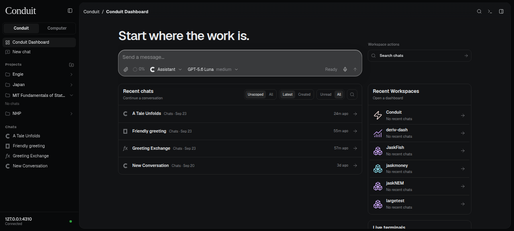

# Conduit



Conduit is a self-hosted, single-user app for working with any coding agent. It
gives chats, working files, Workspaces, attachments, terminals and live agent
sessions one authenticated home, reachable from the web, the desktop and your
phone. Its goal is a durable, personal control plane for agents that work across
local and remote environments.

## Agents

Each agent runs as its own harness; Conduit translates its events into one chat
model, so every agent gets the same transcript, trace, approvals and history.
Adapted today:

- **Conduit Pi** — [Pi](https://github.com/earendil-works/pi) profiles, with
  forks, regeneration, steering and queued prompts
- **Codex CLI** — through `codex app-server`
- **OpenCode** — through its background service and event stream
- **fx** — through `fx acp`
- **ChatGPT Web**

A profile picks the harness, model and effort for a chat. The **Computer** area
opens each installed harness's own sessions, so a thread started in its CLI can
be picked up here. See the [chat backend contract](docs/chat-backend-contract.md)
for what each one supports.

## Architecture

```text
  Pi        Codex CLI     OpenCode       fx        ChatGPT Web     harnesses
   │            │             │           │             │
   ▼            ▼             ▼           ▼             ▼
┌────────────────────────────────────────────────────────────┐
│                      Conduit server                        │
│  adapters · chat logs · Workspaces · terminals · auth      │
└────────────────────────────────────────────────────────────┘
        │  HTTP + one live WebSocket per chat
   ┌────┴──────────────┬───────────────────┬─────────────┐
   ▼                   ▼                   ▼             ▼
 browser / PWA   Windows desktop     Android app     … any number,
                   (Tauri)          (Capacitor)      at once
```

One server holds the agents and the files; any number of clients attach to it,
and a client can hold several servers and move between them
([servers](docs/servers.md)).

## Features

- Persistent chats with attachments, live-streamed thinking and tool calls,
  approvals, model and effort controls (an effort slider or a plain list), and
  per-harness permission modes such as prompt or auto accept.
- **Terminal from anywhere.** A server-owned terminal, backed by tmux, is one
  keystroke or tap away from every chat, dashboard and Workspace, opens in the
  panel or as its own view, survives navigation and server restarts, and brings
  back its shell and the commands it was running.
- **The Workspace panel** sits beside any chat: browse and preview files, edit
  and search them, see Git status, history and diffs, and review what the agent
  changed without leaving the conversation.
- Workspaces that link a local folder, create a managed folder, or clone a Git
  repository, each with its own dashboard, icon and colour.
- **Native clients.** A Windows desktop app and an Android app alongside the
  browser, with a mobile layout built for touch, pinned TLS to your server and
  in-app updates. See [desktop and Android clients](docs/desktop-client.md).
- Push-to-talk and toggle-based voice dictation through managed local Whisper
  and Parakeet tiers or first-class OpenAI, Deepgram, and Groq providers.
- A Docker deployment with automatic HTTPS and persistent data and Workspace
  mounts.

## Deploy

Requires a Linux VPS, a public hostname that points to it, and Docker Engine
with the Compose plugin. On Debian or Ubuntu, the installer can install Docker
when run as root.

```bash
curl -fsSL https://get.jask-aran.com/conduit | bash
```
Enter the public hostname and login password when prompted. Open the HTTPS URL
shown by the installer.

To update an existing deployment:

```bash
~/conduit/scripts/deploy.sh restart
```

See [deployment operations](docs/operations/deployment.md) for custom paths,
release pinning, backup, and restore.

## Start locally

Requires Node.js 22+ and npm.

```bash
bash .devcontainer/start-conduit.sh setup
node scripts/conduit-auth.mjs set-password
bash .devcontainer/start-conduit.sh restart
```

Open <http://127.0.0.1:4310>. Sign in, then open **Settings → Auth** to connect
a model provider.

## Repository map

```text
conduit-web/  Server, harness adapters, web client, native shells, and tests
templates/    Pi profiles, tools, and skills
scripts/      Authentication, deployment, backup, and release tools
docs/         Architecture, operations, and release documentation
```

Development guides:
- [Web runtime and API](conduit-web/README.md)
- [Deployment operations](docs/operations/deployment.md)
- [Runtime data](docs/operations/runtime-data.md)
- [Testing](docs/testing.md)
- [Contributing](CONTRIBUTING.md)
