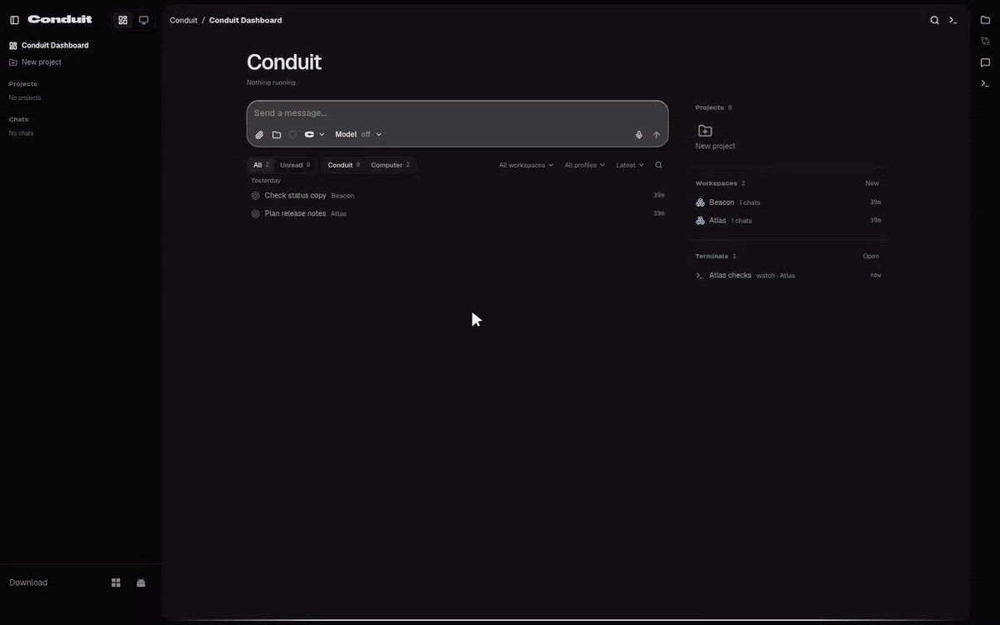
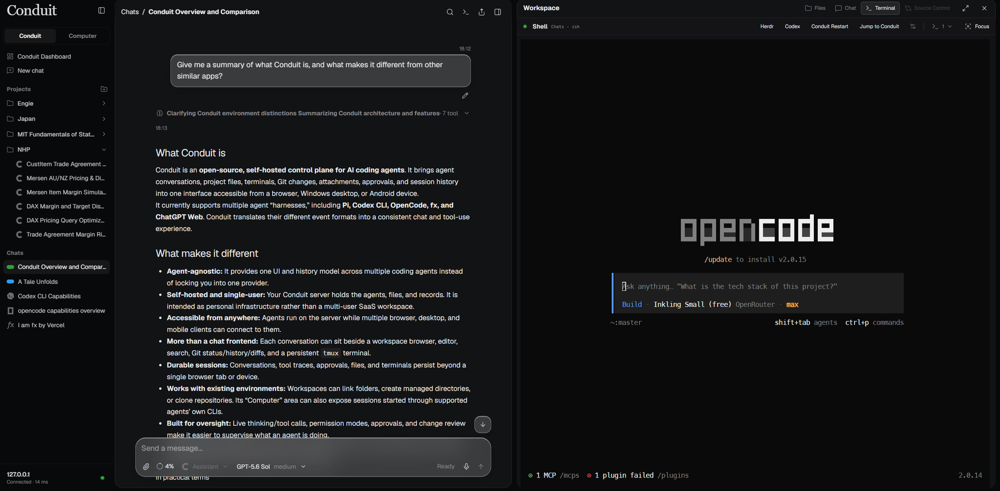
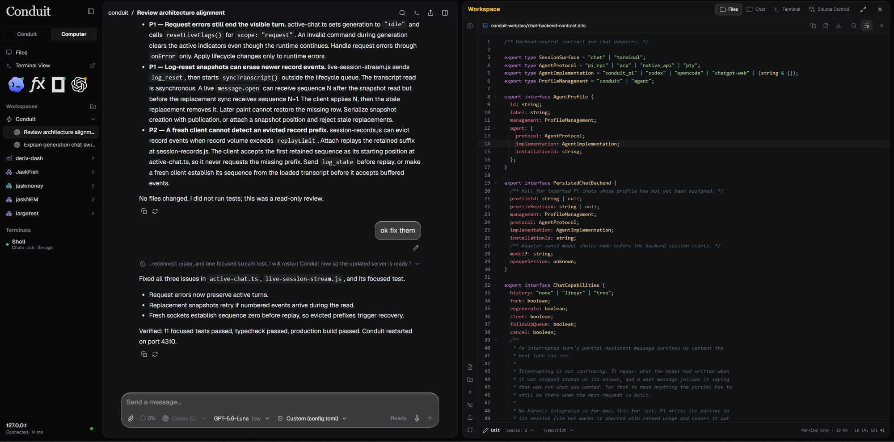
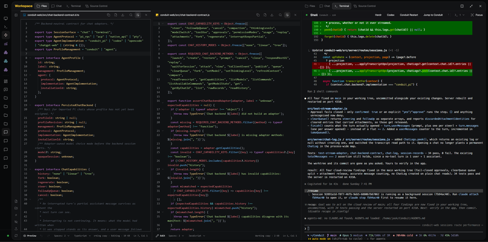
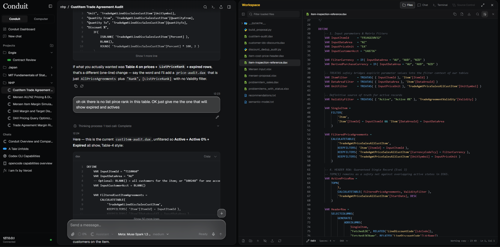

# Conduit

One polished home for the coding agents you run. Chats, a real terminal, files and Workspaces for Pi, Codex, Claude Code, OpenCode and more, self-hosted and available on your desktop, phone and browser.



**Every agent, one transcript.** Follow live thinking, tool calls and history in the same chat interface. Use voice dictation, approvals, attachments, model and effort controls where supported; pick up supported CLI threads from the Computer area.

**A real terminal, everywhere.** Open a WebGL terminal with a shortcut from a chat or place page. Its tmux session keeps running when you navigate away or the server restarts.

**Workspaces beside your chat.** Link any folder, create a managed folder or clone a Git repository. Browse, edit and search files, then inspect Git status and diffs from the Workspace rail and dock.

**Web, Windows and Android on your own server.** Run one Node server for your agents and files, then connect from multiple clients. Each client can keep several servers; the installed apps can find servers on your LAN.

## Supported agents

| Harness | How Conduit drives it |
| --- | --- |
| Conduit Pi | Bundled Pi agent through its RPC interface |
| Codex | Installed Codex through `codex app-server` |
| Claude Code | Installed Claude Code and its saved sessions |
| OpenCode | Installed OpenCode through its shared service and event stream |
| fx | Installed fx through ACP |
| ChatGPT Web | Models from a connected ChatGPT account |

Capabilities vary by harness. See the [backend contract](docs/chat-backend-contract.md) for details.

## Compare

The tlbx and Garcon entries reflect their public [tlbx README](https://github.com/tlbx-ai/tlbx#readme) and [Garcon README](https://github.com/cfal/garcon#readme).

| Capability | Conduit | tlbx | Garcon |
| --- | --- | --- | --- |
| Self-hosted browser access | Yes | Yes | Yes |
| Structured agent conversations and tool calls | Yes | Agent Controller sessions | Yes |
| Terminals beside agent work | Yes | Yes | Yes |
| Files and Git changes beside agent work | Yes | Yes | Yes |
| Claude Code in a structured conversation | Yes | Terminal session | Yes |
| First-party Windows and Android clients | Yes | (verify) | (verify) |
| Several servers in one client | Yes | Hub connects machines | (verify) |

## Screenshots

<p>
  
  
</p>
<p>
  
  
</p>

## Install

On any Linux or macOS computer you want to control (Windows: inside WSL):

```bash
curl -fsSL https://get.jask-aran.com/conduit | bash
```

It installs Conduit and the Node it runs on into `~/.local/share/conduit`, then
asks for a login password and who may reach it, and starts it as a service.
Nothing needs root. Manage it with `conduit status`, `conduit logs` and
`conduit update`; see [install and operations](docs/deployment.md).

## Start locally

Install Node.js and npm, then run:

```bash
bash .devcontainer/start-conduit.sh setup
node scripts/conduit-auth.mjs set-password
bash .devcontainer/start-conduit.sh restart
```

Open <http://127.0.0.1:4310>. Connect a model provider in **Settings > Auth**.

## Repository map

| Path | What it contains |
| --- | --- |
| `conduit-web/` | Server, harness adapters, web UI, native clients and tests |
| `templates/` | Pi profiles, tools and skills |
| `scripts/` | Authentication, deployment and release tools |
| `docs/` | Product, operations and release documentation |

Start with the [web runtime and API](conduit-web/README.md), [desktop and Android clients](docs/desktop-client.md), [several servers](docs/servers.md), [testing](docs/testing.md) and [contributing](CONTRIBUTING.md).

See what shipped recently in [release notes](docs/releases/) and [GitHub Releases](https://github.com/jask-aran/Conduit/releases).
